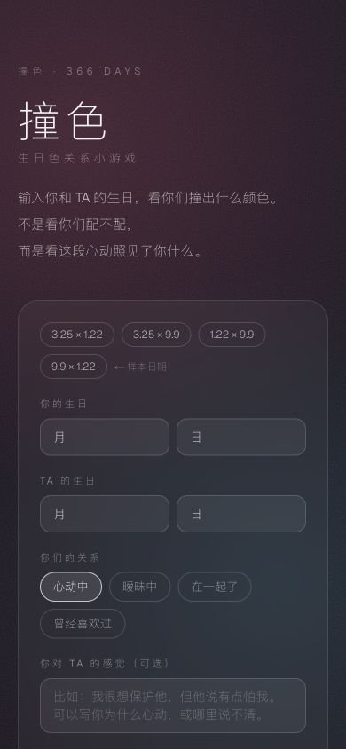
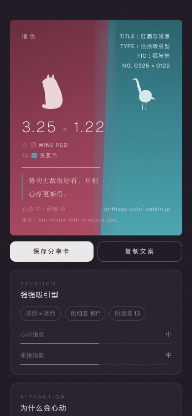
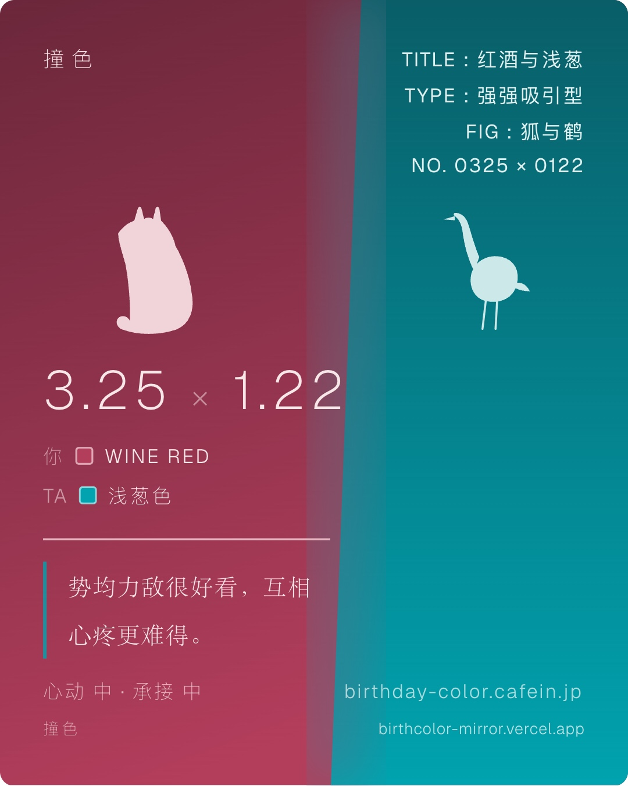

<div align="center">
  <h1>撞色</h1>
  <p><strong>不是看你们配不配，而是看这两种颜色照见了你什么。</strong></p>
  <p><a href="https://birthcolor-mirror.vercel.app">在线体验</a> · 366 日生日色关系小游戏</p>
</div>

<p align="center">
  
  
  
</p>

## 项目概览

“撞色”是一款生日色关系小游戏。输入自己和 TA 的生日，产品会给出双方的官方生日色、关系配色、互动解读与可保存的分享卡；也支持单人查询。

这是我独立完成的产品设计与交付项目：从数据校验、关系模型、视觉语言、移动端体验，到上线与匿名访问统计，完整走通了一个轻量消费产品的发布链路。

## 我负责什么

- 定义“生日色事实 + 关系解读”的产品边界，避免把娱乐体验包装成确定性判断
- 清洗并验证 366 天生日色数据，缺失时不生成虚构替代结果
- 设计双人、单人、结果页和分享海报的完整移动端路径
- 把颜色差异转译为可读的关系维度、意象角色和文案结构
- 处理微信等移动环境下的海报导出稳定性
- 接入隐私友好的 Vercel Web Analytics，不建立用户账号或永久画像

## 关键产品决策

### 1. 事实与解释分层

生日色名称与色值来自公开数据源；关系文字属于产品解读。界面和分享卡都保留来源与娱乐性声明，让用户知道哪部分是事实，哪部分是设计。

### 2. 结果必须“能带走”

结果页不是终点。每组关系都可以生成适合手机保存和转发的竖版海报，让产品天然具备分享闭环。

### 3. 不用登录换取轻体验

项目没有账号、支付、数据库或外部 AI 接口。生日输入只在当前浏览器中参与即时计算，不会被提交到项目后端。

## 产品路径

- `/`：双人 / 单人输入入口
- `/result?self=0325&target=0122&status=crush`：双人关系结果
- `/single?date=0325`：单人生日色结果
- `/promo`：发布宣传长图

## 技术实现

- Next.js 16 / React 19 / TypeScript
- 本地 JSON 数据集与确定性关系计算
- `html-to-image` 生成可下载 PNG 分享卡
- Vercel Web Analytics
- 响应式移动端布局

## 本地运行

```bash
npm install
npm run dev
```

打开 `http://localhost:3000`。

发布前验证：

```bash
npm run lint
npm run build
```

## 数据与声明

生日色事实来自 `birthday-color.cafein.jp`。关系文字属于产品解读，仅供自我观察与娱乐；数据缺失时不生成替代结果。

